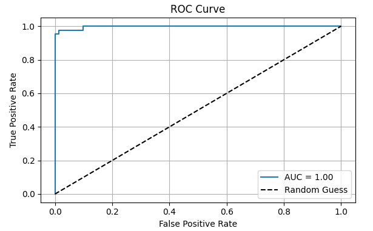

# Classification with Logistic Regression

## Objective
Build a binary classifier using logistic regression to predict outcomes based on input features.

## Tools
- **Scikit-learn**: For machine learning model implementation and evaluation.
- **Pandas**: For data manipulation and preprocessing.
- **Matplotlib**: For visualizing results (e.g., ROC curve).

## Dataset
This project uses the **Breast Cancer Wisconsin Dataset** (`data.csv`), which contains features computed from digitized images of breast mass aspirates to classify tumors as **malignant (M)** or **benign (B)**.

## Mini Guide

### 1. Choose a Binary Classification Dataset
- The Breast Cancer Wisconsin Dataset is used.
- Target variable `diagnosis` is encoded as:
  - 1 = malignant
  - 0 = benign

### 2. Train/Test Split and Standardize Features
- Split the dataset into **80% training** and **20% testing** sets.
- Use `StandardScaler` to standardize features for consistent scaling.

### 3. Fit a Logistic Regression Model
- Train a logistic regression model with `max_iter=1000` to ensure convergence.

### 4. Evaluate with Metrics
Evaluate the model using:
- **Confusion Matrix**: Visualizes true positives, false positives, true negatives, and false negatives.
- **Precision, Recall, F1-Score**: Assesses model performance.
- **ROC-AUC Score**: Measures the model's ability to distinguish between classes.

### 5. Tune Threshold and Explain Sigmoid Function
- A custom threshold (e.g., **0.3**) is applied to the predicted probabilities to adjust the balance between precision and recall.
- The **sigmoid function** in logistic regression maps input features to a probability between 0 and 1:

  \[
  \sigma(z) = \frac{1}{1 + e^{-z}}
  \]

  where \( z \) is the linear combination of features and weights.
  This probability is used to classify instances by comparing it to a threshold (default is 0.5).

## Implementation

The code is provided in **task4.ipynb**. Key steps include:
- Loading and preprocessing the dataset (dropping irrelevant columns like `id`, encoding the target variable).
- Handling missing values using `SimpleImputer` with mean strategy.
- Splitting data into training and testing sets.
- Scaling features using `StandardScaler`.
- Training a logistic regression model and making predictions.
- Evaluating the model with standard metrics and a custom threshold of 0.3.
- Visualizing results (optional: ROC curve plotting).

## Results

- The model is evaluated using a **confusion matrix**, **classification report**, and **ROC-AUC score**.
- A custom threshold of **0.3** is applied to adjust predictions, potentially improving recall for the **positive class (malignant cases)**.

### 📈 ROC Curve  

  
